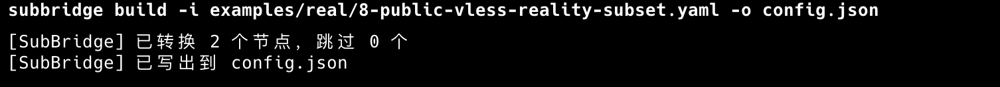
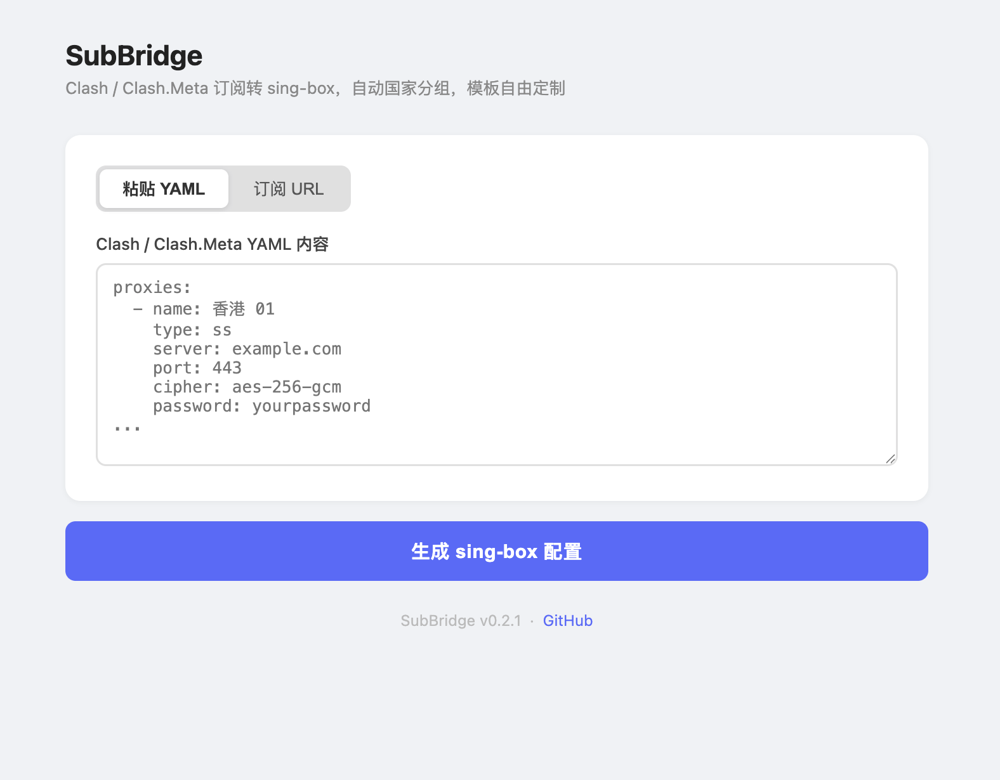

<div align="center">
  <h1>SubBridge</h1>
  <p><b>你的 sing-box 模板，你说了算。把 Clash 订阅的节点注进去，仅此而已。</b></p>
  <p><sub>Clash / Clash.Meta YAML → sing-box 节点注入器 · Clash 转 sing-box · Clash 订阅转换 · 生成完整可运行的 sing-box 配置</sub></p>
  <a href="https://github.com/zzf2333/SubBridge/stargazers"></a>
  <a href="https://github.com/zzf2333/SubBridge/releases"></a>
  <a href="https://www.npmjs.com/package/subbridge"></a>
  <a href="https://www.npmjs.com/package/subbridge"></a>
  
  
  <a href="LICENSE"></a>
</div>

<br/>



<br/>

## 占位符

模板中用这些 JSON 友好的占位符标记注入位置，IDE 语法高亮不受影响：

| 占位符 | 位置 | 展开结果 |
| :--- | :--- | :--- |
| [`{ "$subbridge": "nodes" }`](./docs/template-guide.md) | outbounds 数组 | 所有节点的 outbound 对象 |
| [`{ "$subbridge": "country_groups" }`](./docs/template-guide.md) | outbounds 数组 | 每个国家的 selector + urltest 对象组 |
| [`"$nodes"`](./docs/template-guide.md) | 字符串数组 | 所有节点的 tag 列表 |
| [`"$nodes:HK"`](./docs/template-guide.md) | 字符串数组 | 香港节点的 tag 列表（支持 23+ 地区代码） |

支持协议：Shadowsocks、VMess、VLESS、Trojan、Hysteria2、HTTP，含 TLS / uTLS / Reality / WebSocket / gRPC。

## CLI



```bash
# 零配置：使用内置默认模板（TUN 全局代理 + geo 规则 + 国家分组）
subbridge build -i clash.yaml -o config.json

# 远程订阅
subbridge build -i https://example.com/sub -o config.json

# 多源合并
subbridge build -i clash.yaml -i https://example.com/sub -o config.json

# 取得内置模板副本，按需修改后用 -t 覆写
subbridge init -o my-template.json
subbridge build -i clash.yaml -t my-template.json -o config.json

# 本地 Web UI（浏览器粘贴订阅，自动转换）
subbridge serve
```

## 安装

```bash
npm install -g subbridge
```

或从源码安装（需要 Bun 1.3.5+）：

```bash
git clone https://github.com/zzf2333/SubBridge.git
cd SubBridge
bun install && bun run build && bun run install:local-cli
```

需要 Node.js 18+ 或 Bun 1.3.5+。

## 内置默认模板

不传 `-t` 时工具使用内置默认模板，特点：

| 配置项 | 内容 |
| :--- | :--- |
| **入站** | TUN 全局代理，支持 IPv4/IPv6 |
| **DNS** | 国内域名 → 223.5.5.5；其余 → 8.8.8.8 走代理 |
| **路由规则** | 广告 → block；国内域名/IP → direct；其余 → 代理 |
| **rule_set 来源** | MetaCubeX/meta-rules-dat（GitHub，可替换为镜像） |
| **国家分组** | 自动展开（有节点的国家各生成一个 selector + urltest） |

运行 `subbridge init -o my-template.json` 可取得副本，自由修改每一行。

## 文档

- [Clash / Clash.Meta YAML 转换指南](./docs/how-to-convert-clash-to-sing-box.md)
- [模板使用指南（占位符语法 + 23 个地区代码）](./docs/template-guide.md)
- [自动化验证工具](./docs/verification.md)

## License

MIT
